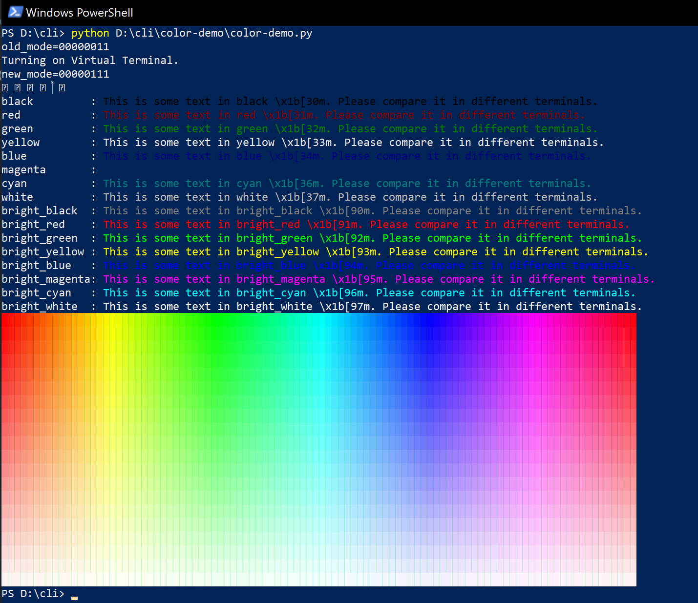

# Color Demo

A demo showing how to use ANSI control sequence with [Virtual Terminal](https://docs.microsoft.com/en-us/windows/console/console-virtual-terminal-sequences).

## Run

Simply use python to run it. [colorama](https://github.com/tartley/colorama) is not required.

```sh
# We need numpy to provide a count-down range
pip install numpy
python color_demo.py
```


## Result

### Windows Terminal running PowerShell Core


### VS Code Terminal running PowerShell Core


### Default PowerShell Core terminal


### Default Windows PowerShell terminal



## References

- https://stackoverflow.com/questions/16755142/how-to-make-win32-console-recognize-ansi-vt100-escape-sequences
- https://docs.microsoft.com/en-us/windows/console/console-virtual-terminal-sequences?redirectedfrom=MSDN
- https://bugs.python.org/issue30075

